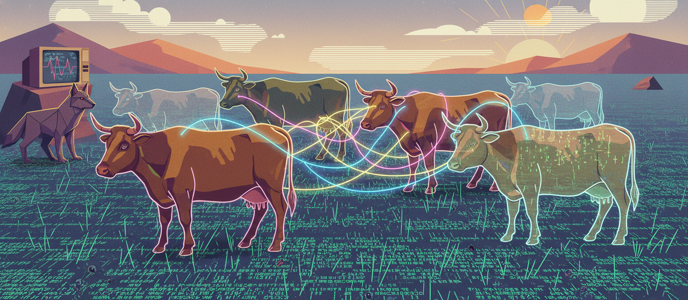

# Dryft



**AI memory that works like an ecosystem, not a filing cabinet.**

Dryft is a living memory architecture for AI systems. Memories aren't static entries. They're a population — a herd — that self-regulates through fitness, bonding, decay, and predation.

Built by a vegetable farmer who thinks in ecosystems. Not a metaphor. A design methodology.

## The problem

AI memory right now is a static field. You write things to files. You search for similar text. When the context window fills up, you compress. Important stuff disappears. Old decisions sit at equal weight to current ones. Nothing ages. Nothing connects. Nothing dies.

In nature, that's not how memory works.

## How Dryft works

**Fitness emergence.** Memories that get used become stronger. Memories that don't, weaken over time. No manual curation. The herd figures it out based on what's actually useful.

**Relational bonding.** Memories that get activated together develop bonds. The more they co-occur, the stronger the bond. "Alice" and "auth team" bond because they keep coming up together, not because someone mapped them. No entity extraction. No knowledge graph. Relationships emerge from use.

**The predator.** Memories at zero fitness for consecutive cycles get culled. Automatically. Every other memory system only adds. Dryft subtracts. That's the part nobody is building, and it might be the most important part.

**Memory types with different lifespans.** Episodic memories (what happened Tuesday) decay faster than semantic memories (what's always true). Procedural memories (how to deploy) don't decay at all.

**Conflict detection.** Contradictory memories get flagged and surfaced for resolution. Wrong memories don't sit there forever.

**Decomposition.** When a memory dies, its substance feeds back into a substrate layer (the "grass"), where patterns can be synthesized into new general knowledge. Death feeds the system.

**Temporal awareness.** The system infers when memories were created, tracks generational lineage, and identifies when newer memories supersede older ones.

## Architecture

Six layers, two herds:

| Layer | Role |
|-------|------|
| **Foundational** | Permanent core knowledge (the "cowbirds") |
| **Grass** | Substrate layer — decomposed memory nutrients feed new growth |
| **Main herd (cattle)** | Operational memories — facts, events, decisions |
| **Eval herd (sheep)** | Evaluative memories — opinions, preferences, assessments |
| **Dormancy staging** | Incubator for new signals before they enter the herd |
| **Temporal** | Time-aware reasoning, supersession detection, carbon dating |

The main herd and eval herd run the same engine but graze separately. Different fitness thresholds, shared grass, no cross-herd bonds. This is mob grazing applied to memory.

## Key parameters

| Parameter | Value | Why |
|-----------|-------|-----|
| Episodic decay | 0.015/query | Events fade faster |
| Semantic decay | 0.005/query | Facts fade slower |
| Procedural decay | 0.0 | Procedures don't fade |
| Activation boost | +0.08 fitness | Used memories get stronger |
| Bond gain | +0.06 per co-activation | Related memories connect |
| Predator floor | 0.1 fitness | Below this, you're prey |
| Grace period | 20 queries | Young memories get time to prove themselves |
| Consecutive cull threshold | 5 cycles | Prey for 5 cycles straight = culled |

## Benchmarks

**Custom benchmark (56 queries, 5 categories):** 83% weighted score. Single-hop 100%, multi-hop 73%, temporal 70%, open-domain 58%, adversarial 100%. Scored by independent judge model (Claude Haiku). This is a custom benchmark built against real usage patterns, not an industry standard.

**LOCOMO (standardized research benchmark, Meta):** 50%. For context: Mem0 published 66.9%, OpenAI Memory published 53%. Dryft's gap is mostly temporal extraction failures and the predator culling memories the benchmark later asks about. The predator tension is the interesting part — what's good for daily use (culling stale memories) costs points on a benchmark that quizzes everything equally.

## Quick start

```bash
# Run with sample data
python simulate.py --live

# Or quiet mode (final state only)
python simulate.py --quiet

# See what happens without the predator
python simulate.py --no-predator
```

Sample data included:
- `memories_sample.json` — 6 example memories demonstrating the data structure
- `queries_sample.json` — 30 queries that exercise fitness, bonding, and predator dynamics

## Core files

| File | What it does |
|------|-------------|
| `herd_engine.py` | The ecology engine: Memory class, fitness scoring, decay, proximity bonding, predator culling, grass layer, decomposition |
| `proxy.py` | Integration layer: context injection into LLM calls, signal detection, conflict handling, multi-turn conversation history |
| `signal_detector.py` | Extracts memory-worthy signals from conversation |
| `conflict_detector.py` | Identifies contradictory memories using LLM classification |
| `conflict_resolver.py` | Resolution queue, humane dispatch (confirmed cull, no decomposition) |
| `temporal_utils.py` | Time-aware reasoning, supersession detection, generational tracking |
| `dormancy_staging.py` | Signal incubator — new signals mature before entering the herd |
| `foundational.py` | Permanent core knowledge store |
| `vector_scorer.py` | Cosine similarity scoring on dense embeddings |

## What this is and isn't

**Is:** A working proof of concept with benchmark results. A design methodology for ecological AI memory. An architecture that self-regulates.

**Isn't:** Production-ready software. A drop-in replacement for Mem0 or similar. A finished product.

The architecture works. Turning it into something that plugs into agent frameworks at scale is a build that needs developer expertise I don't have.

## Design methodology

The ecological framing isn't decorative. It's where every feature came from. 15 years of working with living systems gave me a way of seeing these problems that keeps producing useful answers. The architecture didn't come from studying other memory systems. It came from watching how populations self-regulate.

If you're interested in building on this approach, I'd love to stay involved as the systems designer. The biological thinking keeps generating useful ideas, and it's not something that transfers through code alone.
## License

MIT. Do what you want with it.
